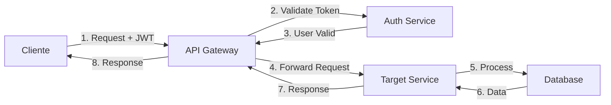

# 📋 Sistema de Gestión de Gastos - Arquitectura de Microservicios

## 🎯 Visión General

Sistema de gestión de gastos personales basado en **arquitectura de microservicios** con las siguientes características:

- ✅ **6 microservicios independientes**
- ✅ **Base de datos única PostgreSQL** (compartida)
- ✅ **Comunicación HTTP/REST** directa
- ✅ **JWT Authentication**
- ✅ **API Gateway** como punto de entrada único

### 🎯 Objetivos del Sistema

- Registrar gastos e ingresos personales
- Categorizar transacciones
- Establecer presupuestos
- Generar reportes y estadísticas
- Exportar datos a PDF/Excel

---

## 🏗 Arquitectura

```
┌─────────────────────────────────────┐
│         Frontend (React)            │
└─────────────┬───────────────────────┘
              │ HTTPS + JWT
┌─────────────▼───────────────────────┐
│          API Gateway                │
└─────────────┬───────────────────────┘
              │
┌─────────────▼───────────────────────┐
│         Microservicios   (Java)     │
├─────────────────────────────────────┤
│ Auth     │ User    │ Category       │
├─────────────────────────────────────┤
│ Expense  │ Income  │ Report         │
└─────────────┬───────────────────────┘
              │
┌─────────────▼───────────────────────┐
│        PostgreSQL Database          │
└─────────────────────────────────────┘
```

---

## 🔧 Componentes del Sistema

### 1. Frontend

- **Puerto:** 3000
- **Tecnología:** React / Vue / Angular
- **Función:** Interfaz de usuario única
- **Comunicación:** Solo con API Gateway vía HTTPS

### 2. API Gateway

- **Puerto:** 8000
- **Funciones:**
  - 🚪 Punto de entrada único
  - 🔀 Enrutamiento de peticiones
  - 🔐 Validación de JWT
  - 🚦 Rate limiting
  - 🌐 Manejo de CORS

### 3. Base de Datos

- **Puerto:** 5432
- **Tecnología:** PostgreSQL 14+
- **Características:**
  - Base de datos única compartida
  - Todas las tablas del sistema
  - Vistas materializadas para reportes

---

## 🚀 Microservicios

### 🔐 1. Auth Service

**Responsabilidad:** Autenticación y seguridad

#### Funciones Principales:

- Login/Logout de usuarios
- Registro de nuevos usuarios
- Generación y validación de JWT
- Refresh tokens
- Recuperación de contraseñas

---

### 👤 2. User Service

**Responsabilidad:** Gestión de perfiles y preferencias

#### Funciones Principales:

- Gestión de perfil de usuario
- Configuración de preferencias
- Cambio de contraseña
- Configuración de moneda y zona horaria

---

### 📁 3. Category Service

**Responsabilidad:** Administración de categorías y presupuestos

#### Funciones Principales:

- CRUD de categorías de gastos/ingresos
- Gestión de presupuestos por categoría
- Categorías predefinidas del sistema
- Personalización de iconos y colores

---

### 💰 4. Expense Service

**Responsabilidad:** Gestión completa de gastos

#### Funciones Principales:

- CRUD de gastos
- Gastos recurrentes
- Filtros avanzados (fecha, categoría, monto)
- Búsqueda por etiquetas
- Adjuntos de recibos

### 💵 5. Income Service

**Responsabilidad:** Gestión completa de ingresos

#### Funciones Principales:

- CRUD de ingresos
- Ingresos recurrentes
- Cálculo de impuestos y monto neto
- Tracking de fuentes de ingreso

---

### 📊 6. Report Service

**Responsabilidad:** Generación de reportes y análisis

#### Funciones Principales:

- Cálculo de balance (ingresos - gastos)
- Reportes mensuales y anuales
- Análisis de tendencias
- Gráficos y estadísticas
- Exportación a PDF/Excel

## 🔄 Comunicación entre Servicios

### Patrón de Comunicación



### Flujo de Ejemplo: Crear un Gasto

1. **Usuario** llena formulario en el Frontend
2. **Frontend** envía petición al API Gateway con JWT
3. **API Gateway** valida token con Auth Service
4. **API Gateway** redirige a Expense Service
5. **Expense Service** valida categoría con Category Service
6. **Expense Service** guarda en base de datos
7. **Expense Service** retorna respuesta exitosa
8. **Frontend** muestra confirmación al usuario
